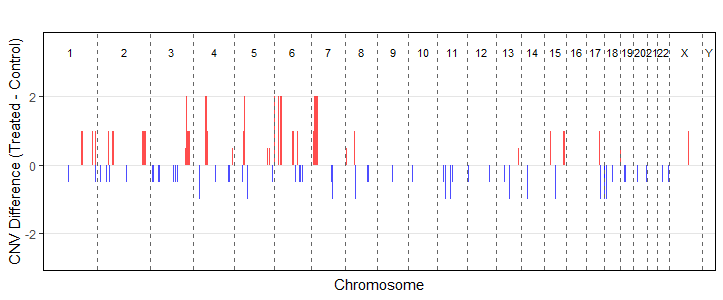
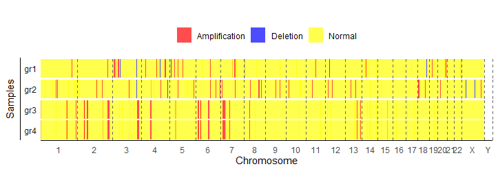

# CNVProcessor Package Documentation

##1. Introduction
   The package relies heavily on the GenomicRanges package, which can be used to fill uncovered CNV areas (default CN=2),
   And the CNV region of multiple samples can be segmented so that two (or more) samples can compare the CN of the same region.
   In addition, several plotting functions are provided in the package that can be used to simply plot the CNV of a single sample or multiple samples and the results of sample comparisons.

##2. Installation
```r
devtools::install_github("LimuLou/CNVProcessor")

##3. Result examples
   ###3.1 Fill the uncovered CNV regions on the chromosomes
  ##### Before
| seqnames | ranges         | strand | cn |
|:---------|:---------------|:------:|:--:|
| chr1     | 9432124-9441040| *      | 4  |
| chr1     | 32450276-32451299 | *    | 0  |

##### After
| seqnames | ranges          | strand | cn |
|:---------|:---------------|:------:|:--:|
| chr1     | 1-9432123       | *      | 2  |
| chr1     | 9432124-9441040 | *      | 4  |
| chr1     | 9441041-32450275| *      | 2  |
| chr1     | 32450276-32451299 | *    | 0  |

   ###3.2 Comparisons between samples
| seqnames | ranges         | strand | gr1_cn | gr2_cn | FC  | change      |
|:---------|:---------------|:------:|:------:|:------:|:----:|:------------|
| chr1     | 9432124-9441040| *      | 4      | 2      | -2  | deletion    |
| chr1     | 16441728-16786935 | *    | 2      | 2      | 0   | no_change   |
| chr1     | 17343904-17359642 | *    | 2      | 3      | 1   | amplification |

   ###3.3 Annotate the CNV regions
| seqnames | start    | end      | width    | strand | cn | gene_id   | gene_symbol |
|:---------|---------:|---------:|---------:|--------|---:|-----------|-------------|
| chr1     | 32454248 | 53181527 | 20727280 | *      | 2  | 100128071 | FAM229A     |
| chr1     | 32454248 | 53181527 | 20727280 | *      | 2  | 100129924 | TMEM269     |
| chr1     | 32454248 | 53181527 | 20727280 | *      | 2  | 100130197 | EFCAB14-AS1 |
| chr1     | 32454248 | 53181527 | 20727280 | *      | 2  | 100130557 | NFYC-AS1    |
| chr1     | 32454248 | 53181527 | 20727280 | *      | 2  | 100132774 | KDM4A-AS1   |

   ###3.4 Plot for different CNV regions between samples
 
 

   ###3.5 Plot for CNV of multiple samples
 
 

 

